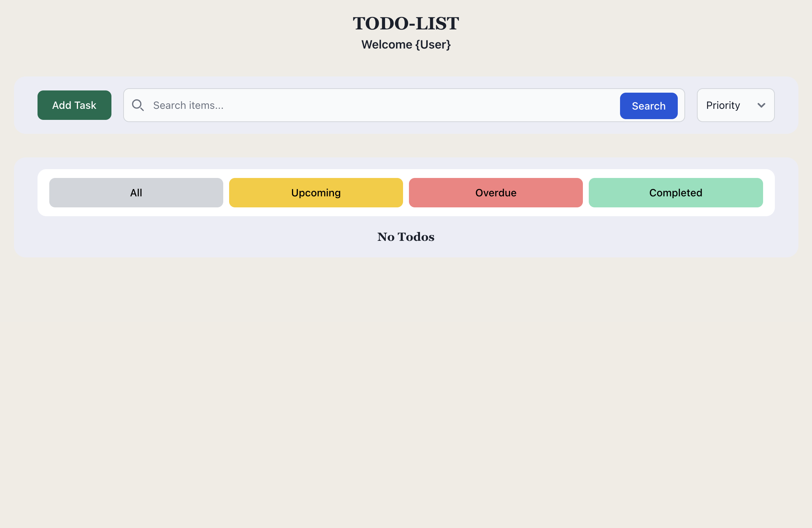
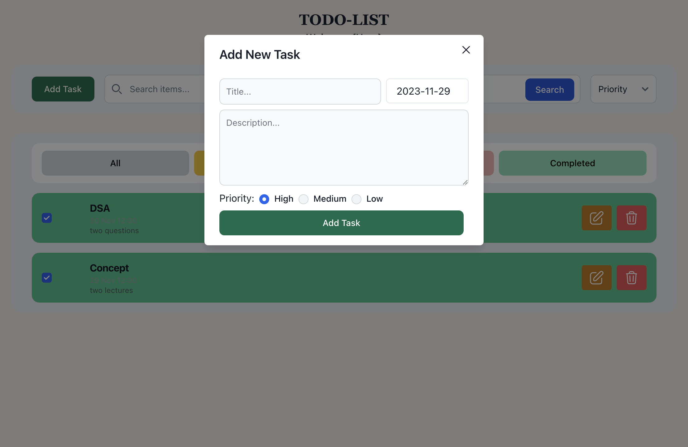
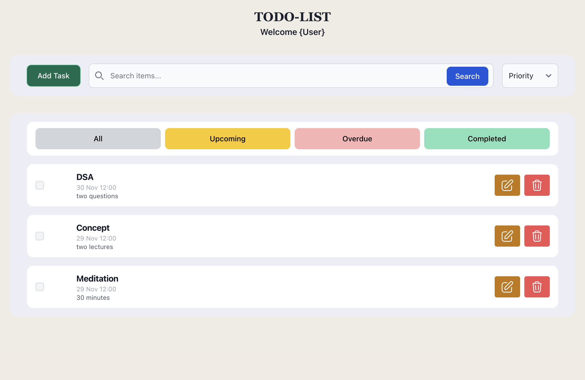
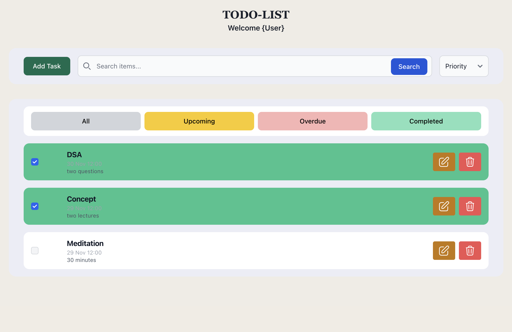
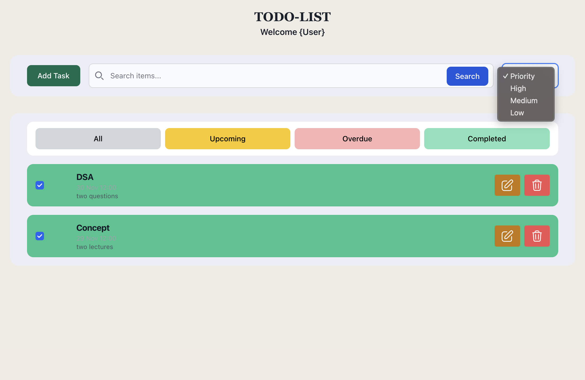

# # Todo App - React-based Task Management System

The Todo App is a user-friendly web application developed using React, designed to streamline task management effectively. This application enables users to efficiently handle their tasks, offering a range of functionalities:


## # Features:

### Task Management:

-   **Create, Update, and Delete Tasks**: Easily add new tasks, modify existing ones, and remove completed tasks.
-   **Task Filtering**: Filter tasks based on their status—complete, incomplete, or overdue—providing a clear view of tasks that need attention.
-   **Priority Sorting**: Sort tasks by priority to focus on critical items first.
-   **Search Functionality**: Utilize the search bar to quickly find specific tasks, enhancing ease of use and efficiency.

### Task Display and Sorting:

-   **View by Creation Time**: Organize tasks chronologically based on their creation time, aiding in tracking task history and progression.

## Screenshots:
**Todo-App**

**Task Creation**

**List View**

**Task Completed**

**Sorting (Priority Based)**


## Getting Started

To start using the Todo App on your local machine, follow these steps:

1. Clone the repository to your local machine:

   ```bash
   git clone hhttps://github.com/kumarshivu12/Elitefit-todo
   ```

2. Navigate to the project directory:

   ```bash
   cd todo
   ```

3. Install project dependencies:

   ```bash
   npm install
   ```

4. Start the development server:

   ```bash
   npm run dev
   ```

The application will be available at [http://localhost:5173](http://localhost:5173).


## Usage
To effectively manage your tasks with the Todo App, follow these usage guidelines:
-   Access the application via a web browser.
-   Create tasks using the 'Add Task' button.
-   Update or delete tasks by selecting the respective options.
-   Filter tasks based on status or priority.
-   Use the search bar to locate specific tasks easily.

## Technologies Used:
-   **React**: Front-end framework for building a responsive user interface.
-   **Chakra UI**: Component library for React applications, facilitating the creation of accessible and customizable UI components.
-   **Tailwind CSS**: Utility-first CSS framework used for rapid UI development by composing classes.
-   **JavaScript**: Programming language used for scripting functionalities and interactivity within the application.

## Contributing

If you'd like to contribute to this project, please follow these steps:

1. Fork the repository on GitHub.
2. Create a new branch for your feature or bug fix:

   ```bash
   git checkout -b my-feature
   ```

3. Make your changes and commit them:

   ```bash
   git commit -m 'Add a new feature'
   ```

4. Push your changes to your fork:

   ```bash
   git push origin my-feature
   ```

5. Submit a pull request to the main repository.

## License

This project is licensed under the MIT License.

---
## Application Link
[Deployed Application](https://elitefit-todo.vercel.app/)


## Support:
-   Contact information for support or inquiries related to the project.

